# When Will Oil Prices Come Back Down?

*Most companies' costs are tied to crude oil. WTI is ~33% above normal, and procurement has to decide: lock in supply now, or wait for a pullback? We used [PyMC's decision-lab](https://github.com/pymc-labs/decision-lab) with **~19 years** of price history (2007–2026) to produce a defensible, probabilistic answer.*

**Teemu Säilynoja · Camilo Saldarriaga · Imri Sofer · **

---

## The Business Problem

You're a procurement team at a company heavily exposed to crude oil costs. WTI (West Texas Intermediate, the benchmark price for US crude oil futures) is sitting at **$90.54 per barrel**: 33% above what you'd consider a normal price. The question isn't academic:

**Do you lock in supply now at today's elevated price, or wait for prices to come back down?**

Locking in too early means paying a premium you didn't need to. Waiting too long means prices might stay elevated, or go higher. You need a number: *what is the probability that WTI returns to normal within 3 months? 6 months? A year?*

This is exactly the kind of question that gets answered badly. An analyst picks one model, gets one number, and presents it with false precision. A more honest answer requires running multiple models, checking whether they agree, and being transparent about the uncertainty.

That's what we did, using [decision-lab](https://github.com/pymc-labs/decision-lab).

---

## What is Decision Lab?

When you ask an AI to analyze data, it does something humans also do: it picks one approach, runs with it, and gives you a confident-sounding answer. The problem is that there are usually many reasonable approaches to the same question (different models, different assumptions) and they can give different answers. If you only run one, you have no way of knowing whether your answer is robust or just an artifact of the method you happened to choose.

[Decision Lab](https://github.com/pymc-labs/decision-lab) is a harness for agentic data science that solves this by running **five independent AI analysts in parallel**, each free to choose its own approach. They work inside a controlled environment with access to a library of vetted statistical methods, but they don't coordinate with each other. Each one reads the data, picks the method it thinks fits best, builds its model, and produces a forecast.

Then a sixth agent, the **consolidator**, compares all five results:

- **If they agree**, that's strong evidence the answer is driven by the data, not by an arbitrary modeling choice.
- **If they disagree**, the consolidator identifies *what* drives the disagreement. Is it a different assumption? A different definition? A different sensitivity to the data? You know exactly where the uncertainty lies.

The whole thing runs from a single command line call. You provide your data, a **prompt** (a detailed briefing that defines your question), and a **decision pack** (a pre-built package of methods and tools for a specific type of problem). Decision Lab handles the rest: data exploration, parallel modeling, quality checks, and a consolidated report.

---

## A Quick Look at the Result

Before we get into how it works, here is the answer the five models converged on:

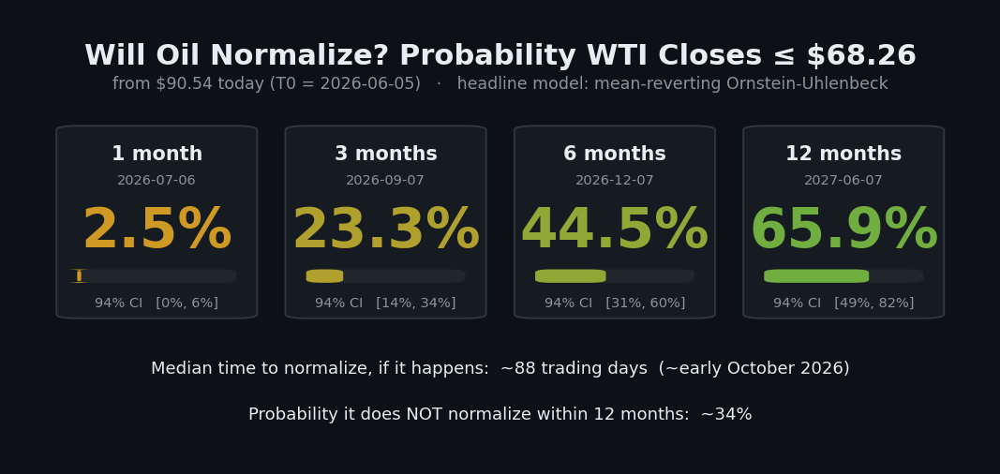

The short version: oil is very unlikely to fall back to $68.26 within a month (~3%), it is close to a coin flip by six months (~44%), and more likely than not within a year (~66%). If it does normalize, the typical timing is around 88 trading days out, early October. The odds climb with the horizon because the models, fitted on 19 years of price history, see oil reliably drift back toward a long-run level that sits just above the threshold. The rest of this post is how we got there, and how much to trust it.

---

## The Setup

To forecast when oil prices will come back down, we need to define three things: what "normal" means (a target price), how far back we look for patterns (the calibration window), and how far forward we want to predict (the horizons).

We used Decision Lab to run five independent Bayesian forecasting models on 19 years of WTI price history. Each model independently chose its own statistical approach, fitted its parameters to the historical data, and simulated thousands of possible future price paths to estimate the probability of normalization at each horizon. Here is the setup:

- **Question:** When will the WTI front-month close return to a "normal" level?
- **Threshold:** WTI ≤ **$68.26/bbl** (the 75th percentile of the 2025 distribution, meaning prices were at or below this level about three-quarters of the time during that calm baseline year).
- **Forecast origin (T0):** 2026-06-05, WTI **$90.54** (~33% above threshold).
- **Horizons:** 1 day, 1 week, 1 month, 3 months, 6 months, 12 months.

### Why 19 years of history matters

A statistical model is only as good as the data it learns from. So we calibrated the models on a **full 4,744-day record back to mid-2007**. 

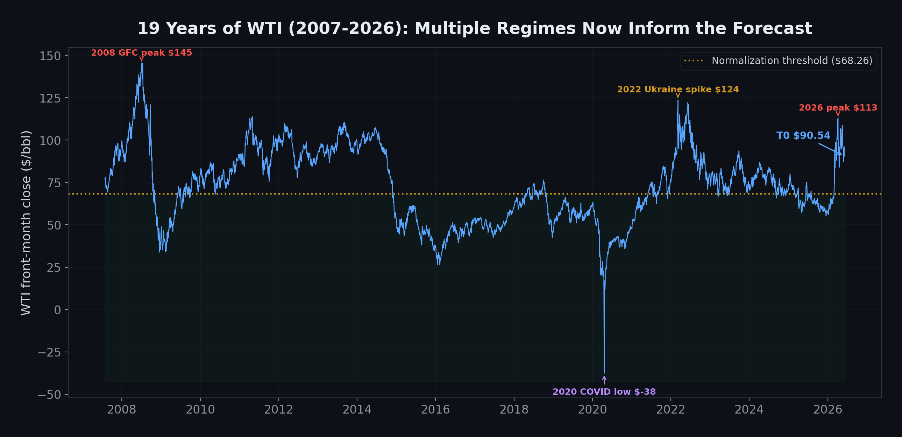

This 19-year window includes several of the most dramatic episodes in oil market history:

- **2008 Global Financial Crisis:** WTI collapsed from $145 to roughly $30 in a matter of months, as global demand evaporated overnight.
- **2014–16 oversupply slide:** A slower but equally dramatic decline, driven by OPEC's decision not to cut production, which pushed prices from $100 to below $30.
- **2020 COVID demand shock:** The most extreme event in the dataset. Lockdowns destroyed demand so fast that WTI futures briefly traded at *negative* prices, something that had never happened before.
- **2022 Ukraine supply spike:** Russia's invasion sent oil above $120 as markets priced in supply disruptions.
- **2024–25 calm baseline:** A relatively stable period with WTI averaging $65, which we use to define "normal."

Each of these episodes teaches the model something different. The crashes show how far and how fast prices can fall. The spikes show how suddenly they can rise. The recoveries show how quickly (or slowly) prices revert after a shock. And the calm periods establish what "normal" looks like.

Without this history, the model would have to guess at these dynamics. With it, the model can *measure* them directly from the data.

### The prompt: telling the AI what to do

Decision Lab's AI agents don't just receive data. They also receive a **prompt**, a detailed set of instructions that defines the question, the threshold, the calibration window, and what outputs to produce. Think of it as a briefing document for the analysts.

Our prompt told each forecaster to use the full 19-year history for calibration, and if they chose to down-weight or exclude any period (for example, treating the 2020 negative-price episode as an outlier), they had to justify that choice explicitly and report how sensitive the forecast was to that decision. This prevents the models from quietly ignoring inconvenient data. We also asked each forecaster to **validate its model out-of-sample with time-slice cross-validation**: hold out a recent slice of history, refit on the earlier data only, and check how often the prices that actually occurred fell inside its predicted intervals.

Here are a few of the most important passages, quoted directly from the prompt:

> **The event (what counts as "normal"):**
> *"Define 'normalized by horizon t' as: the WTI front-month close has fallen to or below 68.26 USD/bbl (the 75th percentile of the 2025 calendar-year WTI distribution) and stayed there."*

> **Full-history calibration, with justified down-weighting:**
> *"Calibrate baseline price dynamics [...] from the FULL ~19-year daily history now provided (2007-07-30 .. 2026-06-05). [...] You MUST justify your calibration window: if you down-weight, exclude, or regime-split any part of the history [...] state exactly what you did and why, and report sensitivity to that choice."*

> **Out-of-sample validation:**
> *"Validate out-of-sample. Run a time-slice (walk-forward / expanding-window) cross-validation or an out-of-sample coverage check: hold out one or more trailing time slices before T0, refit on the earlier data only, and report how often the realized WTI path fell inside your predicted credible intervals [...] report whether roughly 94% of held-out points land in the 94% band, and flag any material miscalibration."*


---

## The Event-Forecaster Decision Pack

A **decision pack** is how you specialize Decision Lab for a specific type of problem. Think of it as a toolkit: it contains the methods the agents can use, the rules for choosing between them, and a locked software environment so results are reproducible.

For this analysis, we used the [event-forecaster](https://github.com/pymc-labs/decision-lab/pull/34) pack, designed for questions of the form *"When will X happen?"* It works for any domain: geopolitical events, market regime changes, supply chain disruptions, clinical endpoints.

### The three agents

The event-forecaster pack runs three types of AI agents, each with a distinct role:

1. **The data explorer** goes first. It reads every data file, computes summary statistics, identifies patterns (trends, jumps, missing values, regime shifts), and writes a structured data summary. This summary becomes the shared starting point for all forecasters. In our case, the data explorer found the fat tails, the slow mean-reversion, and the elevated 2026 regime before any modeling began.

2. **The forecasters** (five of them, running in parallel) each receive the data summary and the prompt. Each one independently decides which statistical method to use, writes and runs its own modeling code, produces a forecast with uncertainty intervals, and runs calibration checks on its own output. They don't see each other's work.

3. **The consolidator** reads all five forecasters' outputs, scores them on technical quality, compares the results, identifies where they agree and disagree, selects a headline forecast, and writes the final report.

### How the agents choose their method

The pack gives each forecaster access to **ten statistical methods** for answering time-to-event questions. Each method is suited to different data situations:

| If the data looks like... | The skill recommends... | In plain terms |
|---------------------------|------------------------|----------------|
| 5+ historical episodes with known durations | **Hazard / Survival Model** | "How long did similar events last in the past?" |
| Historical analogues, even rough ones | **Reference Class** | "What happened in comparable situations?" |
| A price or index that needs to cross a threshold | **Continuous Driver Model** | "When will this number reach that level, assuming smooth changes?" |
| Same as above, but with sudden shocks / extreme moves | **Jump-Diffusion Model** | "Same question, but accounting for sudden crashes and spikes" |
| Leading indicators that predict the event | **Indicator Model** | "Can we see it coming in other signals?" |
| Identifiable paths to resolution | **Scenario Decomposition** | "What are the possible ways this plays out, and how likely is each?" |
| Known causal drivers | **Causal Mechanism Model** | "What factors control whether this happens?" |
| Discrete regimes (calm → crisis → resolved) | **Markov State Model** | "What are the odds of transitioning from the current state to a resolved state?" |
| A threshold the driver must cross, but we don't know exactly where | **Threshold Crossing Model** | "At what level does the event trigger?" |
| The event might never happen | **Cure Rate Model** | "What's the probability this never resolves at all?" |

Each forecaster reads these descriptions, looks at the data, and picks the method that fits best. Nobody assigns methods; the choice is autonomous and must be justified. If all five forecasters independently pick the same family of model, that's a strong signal the data clearly points to one approach.

### Quality control: how the consolidator scores each forecast

After all five forecasters finish, the consolidator evaluates each one on five dimensions:

1. **Did the model converge?**: Bayesian models sample from a probability distribution. If the sampling process is unstable (the technical term is "poor convergence"), the results can't be trusted. The consolidator checks standard diagnostics to verify each model ran cleanly.

2. **Is the forecast sensitive to assumptions?**: If slightly changing the model's starting assumptions dramatically changes the answer, the forecast is fragile. The consolidator checks for this.

3. **Does it match historical patterns?**: If the model says "90% chance within 3 months" but historically only 30% of similar episodes resolved that fast, the discrepancy needs to be explained.

4. **Are the probabilities internally consistent?**: The probability of normalization by 12 months should be at least as high as the probability by 6 months. This sounds obvious, but it's a useful sanity check.

5. **Did the forecaster justify its method choice?**: Did it cite specific features of the data, or just pick a method without explanation?

The consolidator selects the best-scoring forecaster as the headline and flags any disagreements across the five.

---

## Step by Step: From Data to Forecast

### Step 1: Define the threshold

We defined **$68.26/barrel** as the normalization target: the 75th percentile of 2025 calendar-year WTI prices. During 2025, WTI traded between $55 and $80, with a mean of $64.74. The 75th percentile represents "normal but not rock-bottom." At T0, WTI needs to fall **$22.28** (25%) to reach this threshold.

### Step 2: Prepare the data

We assembled daily WTI crude oil futures data spanning **19 years** (mid-2007 through June 2026): 4,744 observations of close prices. This long history gives the models enough episodes of spikes, crashes, and recoveries to robustly estimate jump dynamics and mean-reversion speed.

The WTI front-month close is the series we forecast, but it isn't the only data we fed in. Alongside it, over the same 19-year window, we provided four supplementary daily datasets as market context: **OVX** (the CBOE crude-oil volatility index, which captures how much uncertainty the options market is pricing into oil), the **S&P 500** (level and returns, a broad risk and demand backdrop), three **Asian equity indices** (Nikkei 225, TOPIX, and KOSPI, as demand-side proxies, given Asia's strong dependence on imported oil), and a basket of **tanker and energy-transport equities**. Each forecaster was free to draw on these signals or ignore them. In practice they found that WTI's own price history carried almost all of the forecasting information, with the auxiliary series (OVX especially) useful mainly as a check on the current volatility regime rather than as a leading indicator.

### Step 3: One CLI command

```bash
dlab \
  --dpack ~/decision-lab/decision-packs/event-forecaster \
  --data ~/oil-data \
  --env-file ~/decision-lab/decision-packs/event-forecaster/.env \
  --work-dir ~/decision-lab/dlab-event-forecaster-oil \
  --prompt-file ~/decision-lab/_forecast_prompt_oil.txt
```

The prompt is one of the most important inputs: it defines the question precisely enough that five autonomous agents can work independently and still produce comparable outputs. Here are the key sections (the full prompt is available as [`forecast_prompt.txt`](forecast_prompt.txt) in the iteration directory):

<details>
<summary><strong>The full analysis prompt (click to expand)</strong></summary>

```
CONTEXT (business decision):
We are a company whose costs are heavily exposed to crude oil. We are
currently facing significant market uncertainty and elevated oil prices,
and we need to plan our procurement: specifically, whether to lock in
oil supply now at today's high prices, or wait for prices to come back
down to a more normal level before committing. To support that decision
we need a probabilistic, defensible forecast of WHEN the oil price will
return to a normal level, with credible intervals at several planning
horizons.

EVENT / RESOLUTION CRITERION:
Define "normalized by horizon t" as: the WTI front-month close has
fallen to or below 68.26 USD/bbl (the 75th percentile of the 2025
calendar-year WTI distribution) and stayed there. The current elevation
is treated purely as a market dislocation in the price level: model it
as a time-series / mean-reversion phenomenon, not as any specific
external event. Each forecaster must:
  - State and justify its exact operational threshold
  - Calibrate baseline price dynamics from the FULL ~19-year daily
    history (2007–2026). You MUST justify your calibration window: if
    you down-weight, exclude, or regime-split any part of the history,
    state exactly what you did and why, and report sensitivity to that
    choice.
  - Validate out-of-sample with a time-slice (walk-forward) cross-
    validation or coverage check: hold out a trailing slice, refit on
    the earlier data, and report empirical vs nominal interval coverage.

FORECAST ORIGIN:
T0 = 2026-06-05 (WTI ~$90.54). Measure all horizons forward from T0.

DATA PROVIDED:
  - oil_futures.parquet : WTI front-month close (primary series)
  - ovx.parquet         : CBOE crude-oil volatility index
  - sp500.parquet       : S&P 500 level + returns
  - asian_indices.parquet: KOSPI, Nikkei, TOPIX
  - tanker_equities.parquet: energy-transport equities

HORIZONS: 1 day, 1 week, 1 month, 3 months, 6 months, 12 months

WHAT TO DELIVER:
  - Run several structurally different methods in parallel
  - A time-slice cross-validation / out-of-sample coverage check
  - For each horizon: P(WTI ≤ $68.26) with credible interval, median
    time-to-threshold, P(not reaching $68.26 within 12 months)
  - Consolidated synthesis: where methods CONVERGE and DIVERGE
  - A PROCUREMENT-PLANNING READ: lock in now vs. wait
```

</details>

A few things make this prompt effective: it defines the **resolution criterion** precisely ($68.26, 75th percentile of 2025), it insists on **full-history calibration with justified down-weighting**, it asks each forecaster to **validate out-of-sample with time-slice cross-validation**, and it asks for both the forecast *and* its procurement implications: forcing the agents to translate probabilities into actionable guidance.

### Step 4: The orchestrator explores the data

Before launching forecasters, the orchestrator inspects all 19 years and writes a detailed summary. Key findings:

- **Massive fat tails:** Daily log-returns over 19 years have excess kurtosis around **17.5**, and roughly **1.6%** of days move more than 3σ: both impossible under a Gaussian model (which expects kurtosis 0 and ~0.27% tail days).
- **Multiple major episodes:** The 2008 crash, 2014–16 slide, 2020 COVID shock, 2022 Ukraine spike, and the current 2026 elevation provide diverse calibration data.
- **Weak but measurable mean-reversion:** With 19 years of data, the model can actually estimate the mean-reversion speed: fitted half-life ~199 trading days (~9.5 months), pulling toward a long-run equilibrium of about $70.
- **Current regime elevated and volatile:** WTI has held near $90 through 2026 with 71% annualized volatility, 2.3× the 2025 level.

### Step 5: Five independent forecasters run in parallel

Five forecasters each chose their own method from the skill reference library. All five independently selected a **mean-reverting** model on the standardized log price (Ornstein-Uhlenbeck drift). They split on one detail: two, including the headline, used pure Ornstein-Uhlenbeck, while three added Merton-style Normal jumps on top.

### Step 6: The consolidator evaluates and selects

The consolidator scored each forecaster on convergence diagnostics, prior sensitivity, reference-class congruence, and evidence quality, then selected the best-calibrated forecaster (the pure-OU Instance 1) as the headline.

---

## Why Mean-Reversion? How the Agents Chose Their Method

All five forecasters had ten methods to choose from. All five independently picked the same backbone: **mean-reversion** (technically, Ornstein-Uhlenbeck). The only thing they disagreed on was whether to add explicit jumps on top. To understand why, and why it matters, we need to understand what these models do.

### The backbone: mean-reversion

The core idea is simple: prices are like a rubber band stretched away from equilibrium. The further they're pulled, the harder they snap back. If WTI is $90 and "normal" is $68, the model says prices will gradually drift back down toward a long-run equilibrium.

This is the right starting point here for a concrete, data-driven reason: across 19 years, the fitted equilibrium sits at about **$70/bbl**, just above the $68.26 threshold, and the fitted half-life of reversion is about 199 trading days. Oil really does revert: the 2008, 2014, 2020, and 2022 spikes all eventually reversed. That measurable pull toward a level near the threshold is what gives the long-horizon forecast its upward slope, and it is why the headline forecaster used a pure mean-reversion model.

### The optional add-on: jumps

The catch is that oil prices don't only drift. They **lurch**. The 2008 financial crisis didn't gradually push oil from $145 to $30; it crashed. The 2020 COVID shock didn't gently lower prices; WTI briefly went *negative*. A pure mean-reversion model treats these events as nearly impossible.

A **jump-diffusion** model keeps the mean-reversion backbone and adds a second kind of movement on top:

1. **Everyday noise**, meaning small, continuous day-to-day changes. This is the smooth part, and mean-reversion handles it fine.
2. **Sudden jumps**, meaning large, discrete moves that arrive unpredictably: an OPEC announcement, a geopolitical crisis, a demand collapse. These aren't just "big versions of small moves." They're fundamentally different events, and the model treats them as such.

Three of the five forecasters judged the fat tails important enough to add explicit jumps; two (including the headline) judged the pure mean-reversion model sufficient and more parsimonious. The result is the same family of model with three possible components: a slow pull back toward normal, normal day-to-day volatility, and (optionally) random sudden shocks measured from the ~70 extreme moves in the 19-year record.

### What the data told the agents

With 19 years and 4,744 daily observations, the evidence was rich:

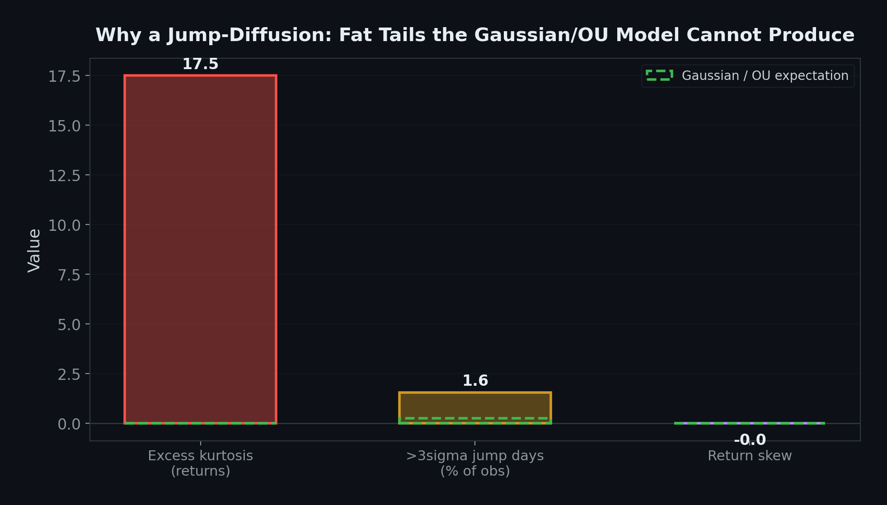

- **Extreme moves are ~6× more common than a smooth model predicts.** About 1.6% of trading days see moves larger than 3 standard deviations. A Gaussian model says this should happen 0.27% of the time. That gap is the signature of jumps, and the reason three forecasters added them.
- **Mean-reversion is real but slow.** Prices do eventually come back: the 2008, 2014, 2020, and 2022 spikes all reversed. But the half-life is ~199 trading days, not weeks. A model that snaps back too fast would badly overstate near-term normalization.
- **The equilibrium sits near the threshold.** The fitted long-run mean is ~$70, only a few percent above $68.26. Over long horizons the process spends a lot of time near that level, which is what lifts the 12-month odds.
- **The current regime is extreme.** 2026 volatility is 2.3× the 2025 level (71% vs 31%), and WTI has stayed elevated for months.

### Why they rejected the alternatives

Each forecaster documented what else they considered and why it didn't fit:

| Method | Why it didn't fit this problem |
|--------|-------------------------------|
| **Survival analysis** (Hazard model) | Needs 5+ historical episodes of "WTI recovering from $90+ to $68." Only a handful exist, and the current regime is near-unprecedented. Too sparse. (In an earlier run one forecaster did fit a hazard model; it sat far above the others and was treated as a high-side sensitivity, not the headline.) |
| **Regime-switching** (Markov model) | Viable in principle, but requires manually labeling which "regime" the market is in. The mean-reversion drift captures regime-like behavior without that manual step. |
| **Leading indicators** | OVX (oil volatility index) was available but had weak predictive power for WTI direction. Not enough signal. |
| **Scenario decomposition** | Would need identifiable resolution paths (e.g., "OPEC increases production"). With price-only data and no geopolitical information, there's nothing to decompose. |
| **Random walk with drift** | No mean-reversion at all. Inappropriate for a commodity price that demonstrably reverts to equilibrium over multi-month horizons. |

The agents didn't just default to one model: they worked through the decision tree, evaluated each alternative against the data's specific properties, and documented their reasoning. The fact that all five independently arrived at the same mean-reversion backbone is itself a finding: for this dataset, that choice is unambiguous. The only genuine in-family debate was how aggressively to model the tails.

### Why this matters for the forecast

Whether you add jumps to the mean-reversion backbone has direct consequences for the numbers:

- **Near-term probabilities are low, and all five agree.** A 25% drop in a few weeks needs large downward moves to actually arrive, and that's rare. Every forecaster puts the 1-month probability near zero.
- **Long-term probabilities depend on the tails.** The mean-reversion pull, compounding over months, eventually lifts the odds toward the ~$70 equilibrium. The pure-OU models reach 66% by 12 months; the jump-diffusion models, which spread more probability into the fat tails, land lower at ~49%. The headline takes the OU view.
- **Uncertainty is honestly wide.** The fat tails that motivate the jump models also widen the credible intervals. This isn't a bug: it's the model correctly reporting that oil prices are hard to predict.

---

## The Forecast

All five forecasters converged on the same mean-reverting family. The headline below is **Instance 1**: the pure-OU model, selected as the primary estimate based on its clean convergence (R-hat 1.00, ESS 1,718, zero divergences) and OK calibration status:


The same forecast as a curve over time, with its 94% credible band:

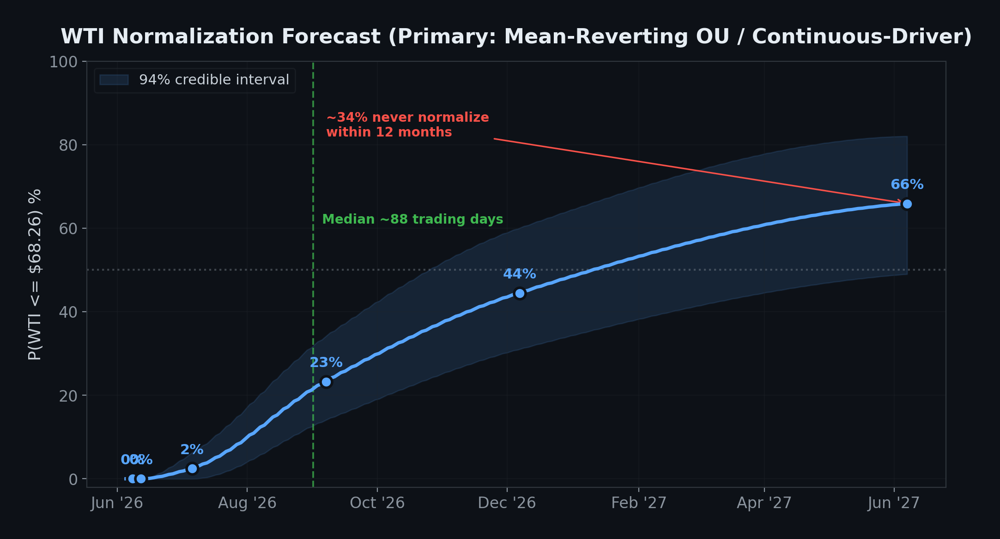

Near-term normalization remains very unlikely: a 25% drop in weeks still requires multiple large downward moves, and that's rare. But at longer horizons, the **mean-reversion signal from 19 years of history** makes a real difference. By 6 months it's close to a coin flip (44%), and by 12 months normalization is more likely than not (66%).

The long history is what makes this possible. With enough episodes of spike-and-recovery, the model can robustly estimate how fast oil prices revert, and where to. The fitted equilibrium of ~$70 sits just above the target, so the mean-reversion pull, compounding over months, shifts the long-horizon odds materially toward normalization.

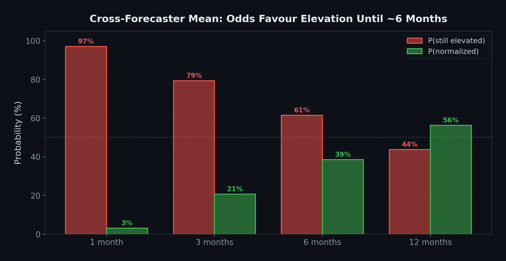

---

## Five Forecasters, One Family

Five agents, different random seeds, the same data: the same mean-reverting family and tightly convergent near-term numbers:

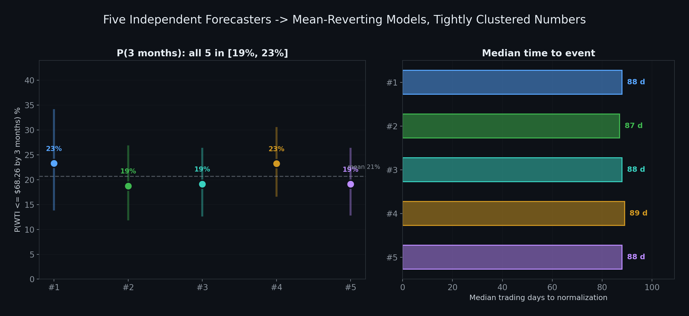

Here are all five forecasters' results side by side:

| Instance | Method | P(1 mo) | P(3 mo) | P(6 mo) | P(12 mo) | Median days | Convergence |
|----------|--------|---------|---------|---------|----------|-------------|-------------|
| **#1 (headline)** | OU | **2.5%** | **23.3%** | **44.5%** | **65.9%** | 88 | OK (R-hat 1.00, ESS 1718) |
| #2 | OU + jumps | 3.3% | 18.7% | 34.4% | 49.1% | 87 | OK (R-hat 1.00, ESS 1710) |
| #3 | OU + jumps | 3.3% | 19.1% | 34.7% | 50.0% | 88 | OK (R-hat 1.00, ESS 1525) |
| #4 | OU | 2.8% | 23.2% | 44.4% | 66.2% | 89 | OK (R-hat 1.00, ESS 1772) |
| #5 | OU + jumps | 3.3% | 19.1% | 34.6% | 49.9% | 88 | MARGINAL (R-hat 1.01, ESS 1654) |

At **3 months**, the five estimates range from 18.7% to 23.3%, a tight ~5pp spread, narrow relative to the ~20pp-wide credible intervals. The two pure-OU forecasters (Instances 1 and 4) cluster at ~23%; the three jump-diffusion forecasters (Instances 2, 3, 5) sit a little lower at ~19%.

At **12 months**, the spread is wider and it tells a story: the two OU models reach ~66%, the three jump-diffusion models land at ~49–50%. The gap reflects a genuine question the price-only data cannot fully settle. If today's elevation is a transient spike, mean-reversion pulls prices back to the ~$70 equilibrium fairly reliably (the OU view, 66%); if the fat-tail / jump dynamics dominate, the path is more dispersed and crossing the threshold is less certain (the jump-diffusion view, ~49%). The headline (Instance 1 at 65.9%) takes the OU view.

Overlaying all five forecasters' normalization curves shows both patterns at once: the lines sit almost on top of each other through the near term, then fan into the two method families (the two OU models high, the three jump-diffusion models lower) only at the long end:

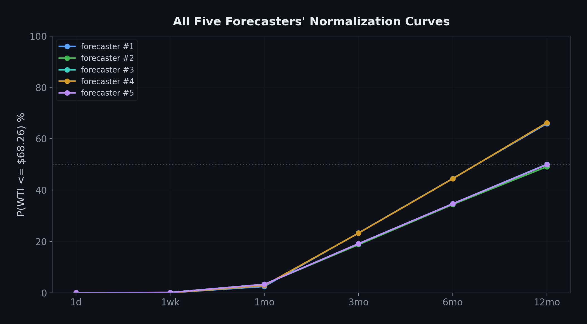

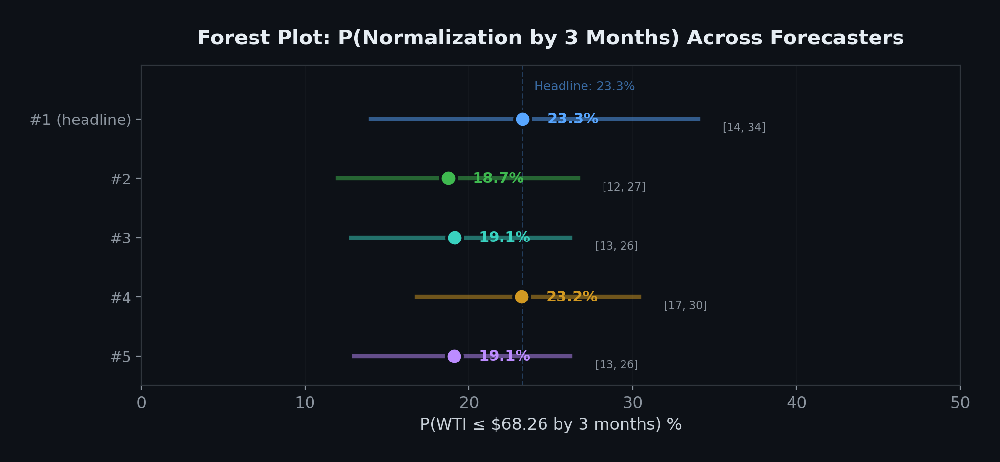
*Forest plot showing each forecaster's point estimate and 94% credible interval for P(normalization by 3 months). The intervals overlap heavily: the posterior uncertainty within any single forecaster dwarfs the differences between forecasters. The dashed line marks the headline estimate (23.3%).*

> **How independent are the five, really?** A fair caveat: all five share the same backbone model (Claude Sonnet 4.5), the same prompt, and the same method library, so "all five agreed" is weaker than five independent verdicts. What the ensemble still buys is a view of where the task is genuinely under-determined: here the agents split on pure OU versus added jumps (a ~15pp gap at 12 months), and an earlier run threw up a much higher HazardModel outlier, disagreements a single run would have hidden.

### Out-of-sample validation: do the intervals hold up?

This run added a check the earlier iterations did not have: each forecaster validates its model with **time-slice cross-validation**. The idea is simple: pretend you're standing at an earlier point in history, refit the model on data up to that point only, then check how often the prices that *actually* followed fell inside the model's predicted intervals. A well-calibrated 94% interval should contain about 94% of the held-out points.

The headline model's 94% bands covered **74% of the held-out 6-month slice, 99% of the 12-month slice, and 100% of the 24-month slice**. The 12- and 24-month results are well-calibrated. The 6-month under-coverage is an honest warning that the model slightly understates short-horizon volatility, which is exactly why the near-term probabilities are best read as lower bounds with room to move up. This is the value of the exercise: the model doesn't just produce a number, it tells you where to trust it and where to be cautious.

---

## Under the Hood: The Full Forecast Distribution

Because each model is Bayesian, we keep the entire posterior: and the entire forecast distribution, not just a point estimate. Translating the headline forecaster's posterior paths back into price space gives a fan chart:

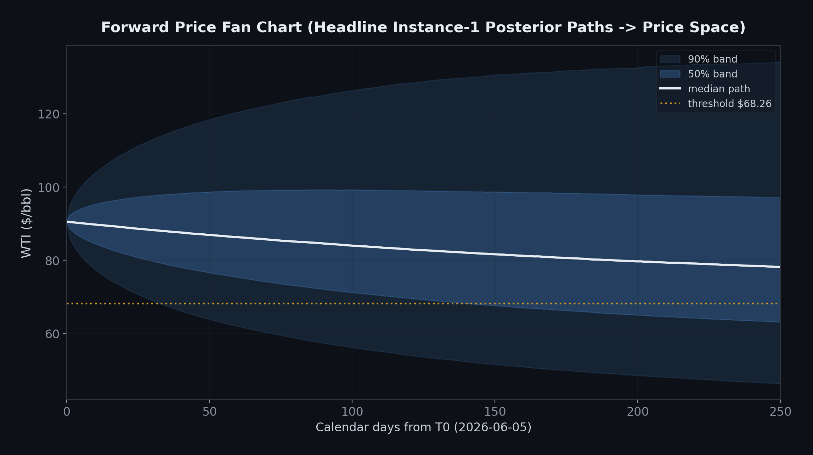

The median path drifts down toward the ~$70 equilibrium, the 90% band is wide and asymmetric (the fat upper tail is the volatility risk), and the lower band crosses the threshold within months. The normalization curve below: the posterior distribution of P(WTI ≤ $68.26) at each horizon: is the same information as a cumulative probability:

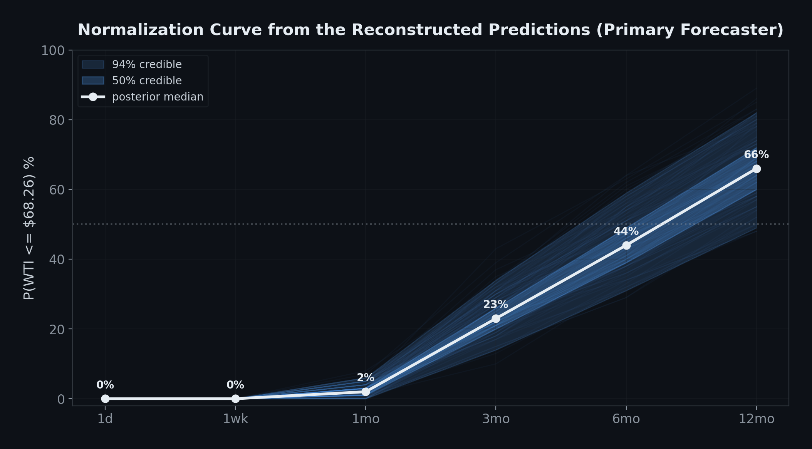

---

## What This Means for Procurement

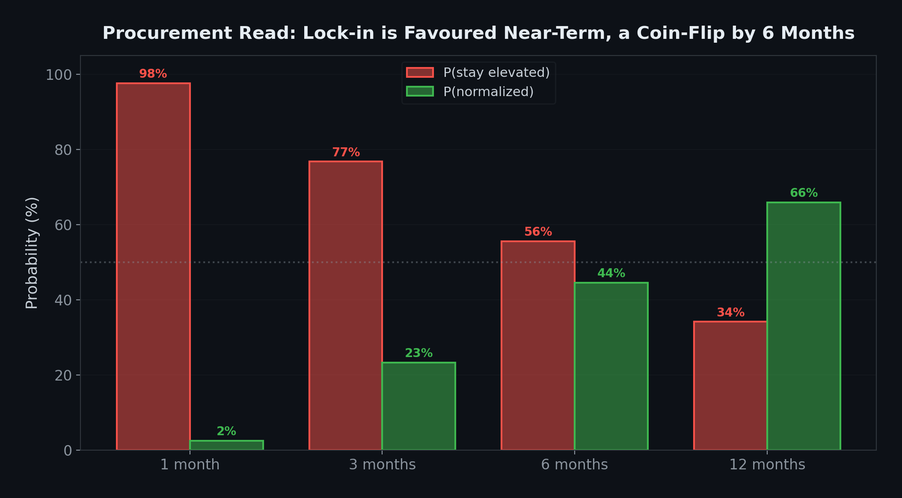

- **If you need supply within ~3 months:** Lock in now, or hedge. There's roughly a **77%** chance WTI is still above $68.26 in early September: waiting mostly carries downside.
- **If your horizon is 6–12 months:** It's more balanced, close to a coin flip by 6 months (44%), tilting to normalization by 12 (66%). Staging purchases with trigger prices (e.g. buy more at $80, then $70) captures early normalization while hedging the ~34% chance prices stay high all year. Note the method split here: if you lean toward the jump-diffusion view, treat the 6–12 month odds as lower (34% / 49%).
- **Watch OVX:** It sits at ~60 (89th percentile). A sustained drop below ~40 would signal the volatility regime is breaking and is a natural trigger to re-forecast on recent data.

---

## The Honest Caveats

The models see only market price and volatility history. They cannot see *why* prices are elevated or whether OPEC, a supply shock, or a demand collapse is about to move them.

The $68.26 threshold is anchored to a calm 2025, and the fitted long-run equilibrium (~$70) sits right on top of it. That proximity is what drives the high long-horizon probabilities, but it also makes them sensitive: a ±10% change in the threshold (or a structural upward shift in "normal") moves the 3-month probability by ~15–20 percentage points and could pull the 12-month odds down substantially.

The 12-month credible interval ([49%, 82%]) is wide by construction, and the pure-OU headline and the jump-diffusion forecasters genuinely disagree at that horizon (66% vs 49%). These are honest limits, not bugs: the value of the exercise is a *defensible, probabilistic* answer with its uncertainty attached: five independent models that agree on the near term and transparently bracket the long term.

---

## What Would Make This Forecast Better

All five forecasters independently identified the same gaps:

1. **Supply-demand fundamentals**: EIA inventories, OPEC production levels, rig counts, demand forecasts
2. **Forward curve data**: WTI futures at 3/6/12 months reveal market-implied expectations
3. **Options-implied volatility**: does the market expect volatility to persist or decay?
4. **CFTC Commitments of Traders**: extreme speculative positioning often precedes reversals
5. **Geopolitical event timeline**: OPEC meeting dates, sanctions announcements, conflict developments

---

## Try It Yourself

This analysis used the [event-forecaster decision pack](https://github.com/pymc-labs/decision-lab/pull/34) from [decision-lab](https://github.com/pymc-labs/decision-lab). If you have time-series data tracking a price, index, or signal, and a threshold that defines your event, you can run the same workflow:

```bash
pip install dlab-cli

dlab --dpack decision-packs/event-forecaster \
     --data path/to/your/price-data \
     --env-file .env \
     --work-dir ./my-forecast \
     --prompt "When will [price/metric] return to [threshold]? Horizons: 1wk, 1mo, 3mo, 6mo, 12mo."
```

**Links:**
- [decision-lab](https://github.com/pymc-labs/decision-lab): the framework
- [Event-forecaster decision pack](https://github.com/pymc-labs/decision-lab/pull/34): the pack used here
- [This analysis (data + outputs)](https://github.com/pymc-labs/oil_procurement_output): full reproducible run

---

## Technical Specifications

**Method:** Mean-reverting models: pure Ornstein-Uhlenbeck (headline, 2 of 5) and OU + Merton-style Normal jumps (3 of 5)
**Backend:** PyMC 6.0 with nutpie sampler
**Data:** 4,744 daily WTI observations (2007–2026)
**Mean-reversion half-life:** ~199 trading days (~9.5 months); fitted long-run equilibrium ~$70.21/bbl
**Convergence:** R-hat ≤ 1.01, ESS ≥ 1,500, zero divergences across all forecasters (four OK, one marginal)
**Out-of-sample:** Time-slice cross-validation, headline 94% interval coverage 74% (6mo) / 99% (12mo) / 100% (24mo)
**Calibration:** ConsistencyCheck PASS, PriorSensitivity PASS across all forecasters
**Runtime:** ~30 minutes, Claude Sonnet 4.5 (all roles)

---

*Built with [PyMC](https://www.pymc.io) and [decision-lab](https://github.com/pymc-labs/decision-lab).*
